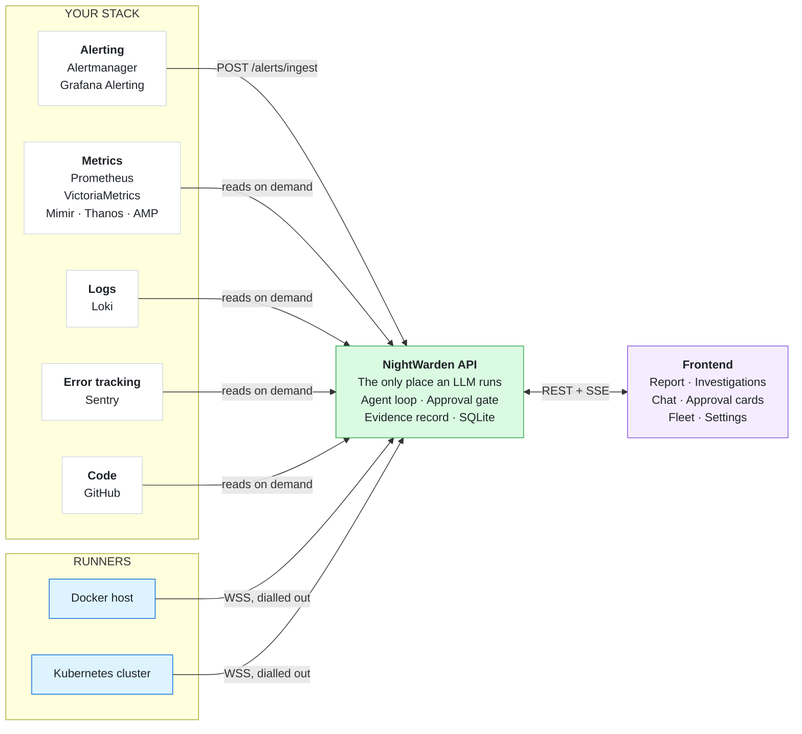

# NightWarden

[](https://github.com/PrabhatMattoo/NightWarden/actions/workflows/ci.yml)   

NightWarden is an open source, self-hosted AI SRE that investigates your incidents from evidence, not hunches - and shows its work. The moment an alert fires it digs into your metrics, logs, container/pod state, exceptions and recent deploys, works out what broke and what it can rule out, and writes it up with the evidence behind every claim and a fix ready for your approval. It investigates on its own; it changes nothing on your systems until you say so.

## How it works



Your Alertmanager or Grafana Alerting posts an alert to the API, and NightWarden opens an investigation for it. It gathers evidence with read-only tools, records each finding with the tool result behind it, and writes up what broke, what it ruled out, who was affected, and what to do. If the fix is a service restart or a code change, it proposes it and pauses for your approval. An investigation reads resolved once the alert that opened it clears, confirmed against your alert source.

NightWarden runs as one image - the API and the frontend on a single origin, with SQLite as the system of record - plus a lightweight runner you install on each Docker host or Kubernetes cluster you want it to act on. With a metrics source, Loki or Sentry alone it investigates read-only; add a runner and it can act.

## Features

- **Evidence behind every claim.** The report draws the exact tool result under each finding - the chart, the matching log lines, the container state, the diff - and a call that found nothing says what it searched.
- **You approve every change.** Reads run on their own so the agent investigates without waking anyone; a restart or a command on your servers waits for you to approve it.
- **It records what it ruled out.** The dead ends land on the report beside the cause, so the next person starts where you finished.
- **Resolved is verified.** An investigation reads resolved once the alert that opened it clears, confirmed from your alert source's own recovery notification or its rules API.
- **Code fixes as draft pull requests.** Connect a GitHub repository and the agent builds and tests a fix in an isolated sandbox, then opens a draft pull request for you to review and merge.
- **Bring your own monitoring.** Point Prometheus, Loki, Sentry, and Alertmanager or Grafana at NightWarden. Any sender that speaks the Alertmanager envelope fits too, including Mimir, Thanos and VictoriaMetrics.
- **Bring your own model.** Use Anthropic, OpenAI, or OpenRouter. Inference goes straight to your provider and your key stays on your network.
- **Your data stays put.** One SQLite file on your own infrastructure, no telemetry.
- **Durable approvals.** Approve hours later and the agent resumes from where it paused.
- **Works behind NAT.** Runners dial out to the API, so there are no inbound ports to open on your servers.

## Install

NightWarden runs as one container on one Linux host with Docker - no database to run alongside it.

```bash
curl -O https://raw.githubusercontent.com/PrabhatMattoo/NightWarden/main/docker-compose.yml
export NIGHTWARDEN_PUBLIC_URL=http://203.0.113.10:3000   # routable from your servers, not localhost
docker compose up -d
```

`NIGHTWARDEN_PUBLIC_URL` is the only variable you must set - the address runners dial back to and Alertmanager posts to, so a browser's `localhost` is not it. Open it, create your account, and under **Settings → Provider** pick a provider, paste a key, and choose a model. Then connect your monitoring - and optionally a runner and a GitHub repository - from **Integrations**, where every connection is probed before it saves, so a green card means it is reachable.

Everything else has a default. See [Configuration](ARCHITECTURE.md#configuration) for every variable and [Connecting integrations](ARCHITECTURE.md#connecting-integrations) for what each card needs.

## Documentation

- **[ARCHITECTURE.md](ARCHITECTURE.md)** - how it is built, every term defined, and what it does in each situation
- **[CHANGELOG.md](CHANGELOG.md)** - what changed, newest first

## Development

Node.js 24 or newer, pnpm 11 or newer, and an Anthropic, OpenAI or OpenRouter API key.

```bash
git clone https://github.com/PrabhatMattoo/NightWarden.git
cd NightWarden
pnpm install
pnpm dev
```

That starts the API on port 3000 and the frontend on port 5173, both with live reload. Four checks gate every change and are exactly what CI runs: `pnpm typecheck`, `pnpm test`, `pnpm format:check`, `pnpm build`.

## License

NightWarden is open source under the [GNU Affero General Public License v3.0](LICENSE). Run it on your own infrastructure, for any purpose, free and without limits. If you run a modified version as a network service, the AGPL requires you to offer its source to that service's users.

NightWarden's terms cover NightWarden. Its dependencies stay under the licences their own authors granted: every image carries `LICENSE` and `NOTICE` at its root, and the licence text of everything bundled into the frontend is served at `/THIRD-PARTY-LICENSES.txt`.

For commercial or proprietary use outside the terms of the AGPL, contact the maintainers about a separate licence.
