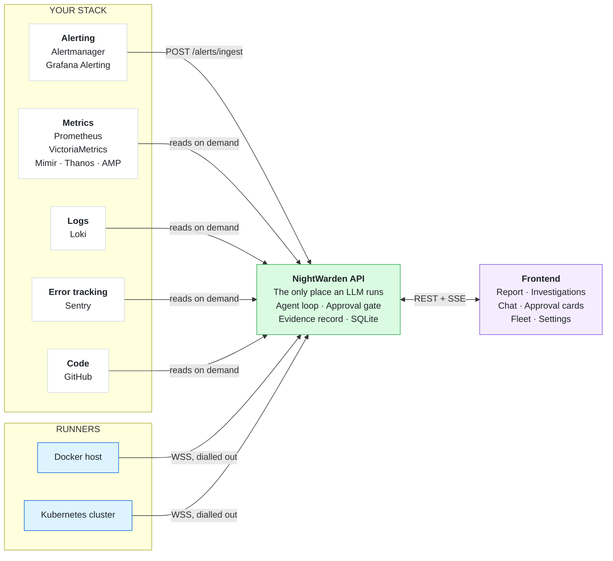

# NightWarden

[](https://github.com/PrabhatMattoo/NightWarden/actions/workflows/ci.yml)   

NightWarden is a self-hosted, open source AI SRE agent for Docker and Kubernetes workloads. It watches your servers and clusters, and when something breaks it investigates the problem on its own, works out the smallest safe fix, and waits for you to approve it before touching anything.

## Why NightWarden

An alert fires at 3am. Normally that means waking up, SSHing into a box, reading logs, checking `docker ps` or `kubectl get pods`, correlating a recent deploy, and only then deciding what to do. The investigation is slow, manual, and always lands on a tired human.

NightWarden does that first pass for you. The moment an alert arrives it starts pulling logs, container or pod state, and host metrics, works out what caused the failure, and drafts a concrete fix - restarting a service, or, when the cause is in your code and a repository is connected, a draft pull request. It records what it finds as it goes and writes the whole thing up when it is done, so by the time you look at your screen the investigation is already written up: what it thinks broke, what it ruled out, the evidence behind each, and a fix waiting for one click.

The important part is what it will not do. NightWarden never changes anything on a server without your explicit approval. It reads freely and acts only on permission, so you get the speed of an automated responder with the safety of a human gate.

## How it works



Your data stays on your machine: one SQLite file, no telemetry, and nothing forwarded on a schedule.

When an alert fires, your Alertmanager or Grafana Alerting posts it to the API's ingest endpoint. One webhook delivery is one alert group, and that grouping is yours: whatever `group_by` you already configured decides which alerts are investigated together, and NightWarden never regroups them on a clock of its own. The API opens a session for the group and runs the agent loop: it calls read-only tools on the relevant runner - service logs, process lists, metrics - feeds the results back to the model, and keeps going until the model proposes a fix or asks you a question.

As it works it builds an **investigation record**, one claim at a time. Each time it settles a hunch it writes down what it tested, the verdict it earned and the ids of the tool calls that back it. Nothing it wrote earlier can be edited or deleted, so a claim it later abandoned stays on the record beside the one that replaced it. How well each claim is backed is worked out by the system from those citations, never claimed by the model.

When the run is over the agent is handed that record back with every investigation tool taken away and one left, and writes the report from it: a summary, a timeline, who was affected, and what you should do. The run cannot end on an empty record, or with reads nothing on the record speaks for, and if it genuinely cannot work out the cause it says so instead of inventing one.

**A fix is not believed until the alert says so.** NightWarden never asks the model whether its fix worked. It re-checks the condition that fired, either from your alert source's own resolved notification or by asking the rules API whether the rule that fired still holds. If nothing can answer, the investigation says the fix ran but recovery was never confirmed - it does not read "Resolved".

**What a tool does and what you permit are two separate facts.** Every tool declares an _effect_ - whether the call reads or writes - and a _policy_ - whether it runs on its own or waits for you. Reads run freely so the agent can investigate without waking anyone. Writes pause the loop and show you an approval card, and nothing resumes until you approve, reject, or answer. The two are recorded apart on purpose, so there is no separate list of gated actions that could fall out of step with the actions themselves.

When a GitHub repository is connected and the cause is in your code, the same loop checks the code out into an isolated sandbox on the API host, builds and tests a fix there, and leaves a draft pull request for you to review.

For the full detail - every term, the session lifecycle, prompt assembly, the evidence rules - see [ARCHITECTURE.md](ARCHITECTURE.md).

### The three pieces

**API** is the brain, and the only place an LLM ever runs. It owns all durable state (a single SQLite file as the system of record, plus sandbox workspaces and generated proxy config in the same state directory), drives the agentic loop, gates every server write behind human approval, and talks to runners exclusively over an outbound-initiated WSS connection. When a GitHub repository is connected it is also the piece that provisions the per-session code sandbox and opens draft pull requests.

**Runner** is an executor you install on each host or cluster you want monitored, and it comes in two: a Docker runner and a Kubernetes runner. Which one you installed is what it is - it never probes for a platform, and one runner never serves both. It opens an outbound WSS connection to the API (so it works behind any firewall or NAT, with no inbound ports), advertises the services or workloads it can see, and executes the read and approval-gated write commands the API sends. It writes nothing to disk and remembers nothing across restarts. It is optional: a fully read-only investigation can run on your metrics, logs, and connected repository alone.

**Frontend** is the user UI, built around the report rather than the chat. The sidebar holds navigation and nothing else - Agent, Investigations, Integrations, then Settings and Log out - and collapses to a narrow icon strip when you want the full width for reading. Investigations have a page of their own, grouped by status. Open one and the report takes the main area - the answer, what to do, what happened, what held up and what was ruled out, each claim showing what backs it - with the transcript in a rail on the right that also collapses.

## Features

- **A report, not a wall of chat.** The agent records each claim as it settles it, then writes the report from that record once the run is over: a headline, a summary you can paste into a postmortem, a timeline that includes every write it was allowed to make, who was affected, and what to do next. What backs each claim is drawn beneath it from the recorded results - a chart of every series the query returned, the log lines that matched against how many were searched, the state a container was in, the diff of a change - so the report still renders long after your metrics retention has rolled over. Each claim quotes the exact tool call behind it and carries a grade the system worked out from those citations.
- **It cannot finish without concluding.** A run is not allowed to end on an empty record, or on a claim backed only by a call that returned nothing, and no claim can be recorded at all without citing one. If it cannot find the cause it records what it ruled out and says so.
- **"Resolved" means the alert stopped firing.** Not that a fix ran, and never because the model said it found the cause.
- **One investigation per alert group.** Relatedness is your alert source's call, not a guess of ours. Ten investigations run at once by default; beyond that alerts wait their turn and nothing is dropped.
- **An investigation is a session with a condition attached, and only an alert carries one.** Typing opens a chat, which answers the question and stops; an alert opens an investigation, which works it out and writes a report. Both get the full toolset behind the same approval gate.
- **Docker and Kubernetes, kept apart.** Two runners, two images and two toolsets, not one runner with a switch. A command sent to the wrong kind of runner has no handler to reach.
- **Invisible to its own agent.** NightWarden's control plane is filtered out of every list the agent can reach, so it is never suggested, never addressable, and cannot be restarted mid-investigation.
- **Human-in-the-loop by default.** `RestartDockerService`, `DockerExec`, `RestartK8sWorkload` and `K8sExec` require explicit approval. Reads run automatically so the agent can investigate without waiting on you.
- **Code fixes as draft pull requests.** Connect a GitHub repository and the agent can read the code, build and test a fix inside a hardened per-session sandbox, and propose it as a draft pull request. A human always reviews and merges - NightWarden never merges.
- **Durable suspend and resume.** A pending approval survives an API restart. You can approve hours later and the agent picks up exactly where it left off.
- **A broken run tries again, but only when that can help.** Retried up to three times on a dropped connection or a rate limit; never retried on a rejected key or a missing model, because that would fail identically every time.
- **Works behind NAT.** Runners dial out to the API over WSS. There are no inbound ports to open on your servers.
- **Bring your own key.** Use Anthropic or OpenAI directly, or OpenRouter for everything else. Inference goes straight to your provider and your key never leaves your network.
- **Multi-runner.** One API coordinates as many runners as you have hosts and clusters, and a single investigation can span more than one.
- **No external infrastructure.** All durable state is one SQLite file in the state directory.
- **Bring your own monitoring.** Point your existing Prometheus, Loki, and Alertmanager or Grafana Alerting at the ingest endpoint. Anything that sends the Alertmanager envelope is accepted, which covers Mimir, Thanos and VictoriaMetrics too. Nothing to rip out.

## Install

NightWarden ships as one image: the API and the frontend on a single origin, with SQLite as the system of record. One container on one Linux host with Docker, and no database alongside it.

```bash
curl -O https://raw.githubusercontent.com/PrabhatMattoo/NightWarden/main/docker-compose.yml
export NIGHTWARDEN_PUBLIC_URL=http://203.0.113.10:3000   # routable from your servers, not localhost
docker compose up -d
```

`NIGHTWARDEN_PUBLIC_URL` is the only variable you must set. It is the address runners dial back to and Alertmanager posts to, so a browser's `localhost` is not it. Everything else has a default and is listed in [Configuration](ARCHITECTURE.md#configuration).

Open that address, create the owner account, then go to **Settings → Provider**: choose Anthropic, OpenAI or OpenRouter, paste a key, press **Test connection**, and pick a model. Until that is done NightWarden refuses to start investigations rather than failing at the first alert.

## Connect your stack

In the frontend go to **Integrations**, where each card is grouped by what it gives an investigation: **Alerting** (where your alerts come from), **Metrics**, **Logs**, **Error tracking**, **Fleet** (executors on your hosts), and **Code**. None is strictly required to start a chat; investigations need an alert source plus at least one evidence source - a runner, a metrics source, Loki, or Sentry.

Every connection is probed with the exact calls an investigation makes before anything is saved, so a successful connect is itself the proof it is reachable. Both evidence URLs are dialled by the API from its own machine, so an address that works in your browser is not the test: containerized, `localhost` means the API's own container, and on a separate host you need an address routable on your private network.

Adding a runner is three steps and needs no manual config editing - name it, run the install command NightWarden prints, and confirm what it sees. Wiring your alerts is pasting a receiver block into your `alertmanager.yml` or filling in a Grafana webhook contact point. **The ingest credential is shown once**: NightWarden stores only a hash, so copy it when it is generated.

[ARCHITECTURE.md](ARCHITECTURE.md#connecting-integrations) has what each card asks for, why, and the gotchas - the separate rules URL, Sentry's two token scopes, the one-metrics-source rule, and the sandbox hardening behind the GitHub integration.

## Documentation

- **[ARCHITECTURE.md](ARCHITECTURE.md)** - how it is built, every term defined, and what it does in each situation
- **[CHANGELOG.md](CHANGELOG.md)** - what changed, newest first

## Development

Node.js 24 or newer, pnpm 11 or newer, and an Anthropic, OpenAI or OpenRouter API key.

```bash
git clone https://github.com/PrabhatMattoo/NightWarden.git
cd NightWarden
pnpm install
pnpm dev
```

That starts the API on port 3000 and the frontend on port 5173, both with live reload. Four checks gate every change and are exactly what CI runs: `pnpm typecheck`, `pnpm test`, `pnpm format:check`, `pnpm build`. See [Development](ARCHITECTURE.md#development) for the detail.

## License

NightWarden is open source under the [GNU Affero General Public License v3.0](LICENSE). Run it on your own infrastructure, for any purpose, free and without limits. If you run a modified version as a network service, the AGPL requires you to offer its source to that service's users.

NightWarden's terms cover NightWarden. Its dependencies stay under the licences their own authors granted: every image carries `LICENSE` and `NOTICE` at its root, and the licence text of everything bundled into the frontend is served at `/THIRD-PARTY-LICENSES.txt`.

For commercial or proprietary use outside the terms of the AGPL, contact the maintainers about a separate licence.
